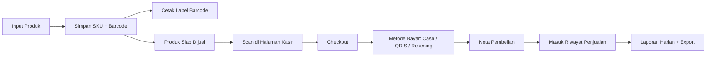

# Kasir Stok App

Sistem kasir berbasis **Laravel 13**, **Tailwind CSS 4**, dan **MySQL** untuk kebutuhan toko yang ingin mengelola:

- transaksi kasir
- stok barang
- barcode produk
- nota pembelian
- rekap dana masuk per metode pembayaran
- laporan harian yang bisa diexport

Project ini disiapkan untuk environment lokal **Laragon** dengan database **MySQL**.

## Preview

### Dashboard Operasional


### Halaman Kasir


### Laporan dan Barcode


## Fitur Utama

- Login dan pemisahan hak akses berdasarkan role:
  - `admin`
  - `stok`
  - `kasir`
- Dashboard operasional:
  - total produk
  - stok menipis
  - transaksi hari ini
  - pendapatan hari ini
  - breakdown dana masuk per metode pembayaran
- Manajemen kategori produk
- Manajemen produk:
  - SKU
  - barcode
  - harga modal
  - harga jual
  - stok awal
  - minimum stok
- Barcode scanner di halaman kasir:
  - scan barcode
  - input SKU
  - produk otomatis masuk ke transaksi
- Metode pembayaran:
  - `cash`
  - `QRIS`
  - `rekening`
- Checkout kasir dengan:
  - diskon
  - pajak/biaya
  - uang pas
  - nominal cepat untuk pembayaran cash
- Nota pembelian siap print
- Cetak label barcode produk langsung dari sistem
- Mutasi stok dan histori stok
- Riwayat penjualan
- Laporan penjualan harian:
  - filter tanggal
  - filter metode pembayaran
  - export CSV untuk rekap harian

## Tech Stack

- PHP `8.3+`
- Laravel `13`
- Tailwind CSS `4`
- Vite
- MySQL
- Blade Components

## Struktur Fitur

### Modul Stok

- Kategori produk
- Produk dan barcode
- Mutasi stok
- Cetak label barcode

### Modul Kasir

- Scan barcode / input SKU
- Tambah item transaksi
- Pilih metode pembayaran
- Nota pembelian

### Modul Laporan

- Riwayat penjualan
- Rekap harian
- Export transaksi

## Metode Pembayaran

Sistem saat ini mendukung:

- `Cash`
- `QRIS`
- `Rekening`

Catatan:

- Untuk `QRIS` dan `rekening`, nominal dana masuk otomatis mengikuti `grand total`.
- Untuk `cash`, kasir bisa menggunakan:
  - checkbox `Uang Pas`
  - tombol nominal cepat

## Fitur Barcode

Barcode pada sistem dipakai di dua sisi:

1. **Input barang**
   - setiap produk bisa punya barcode unik
   - barcode bisa diisi manual atau dari hasil scan

2. **Transaksi kasir**
   - scanner barcode akan dibaca seperti keyboard
   - scan produk akan langsung menambah item ke transaksi
   - jika produk yang sama discan lagi, qty otomatis bertambah

3. **Cetak stiker barcode**
   - label barcode bisa dicetak langsung dari halaman produk
   - cocok untuk kebutuhan stiker rak atau kemasan barang

## Alur Sistem



## Instalasi

### 1. Clone repository

```bash
git clone https://github.com/username/kasir-stok-app.git
cd kasir-stok-app
```

### 2. Install dependency backend

```bash
composer install
```

### 3. Install dependency frontend

```bash
npm install
```

### 4. Copy file environment

```bash
copy .env.example .env
```

Jika menggunakan Git Bash atau terminal Unix-like:

```bash
cp .env.example .env
```

### 5. Generate app key

```bash
php artisan key:generate
```

## Setup Database MySQL di Laragon

Project ini disiapkan untuk **Laragon**, bukan Herd database.

### 1. Pastikan MySQL Laragon aktif

### 2. Buat database baru

Nama database default:

```text
kasir_stok_app
```

Contoh lewat terminal:

```bash
mysql -u root -e "CREATE DATABASE kasir_stok_app CHARACTER SET utf8mb4 COLLATE utf8mb4_unicode_ci;"
```

### 3. Pastikan konfigurasi `.env`

```env
DB_CONNECTION=mysql
DB_HOST=127.0.0.1
DB_PORT=3306
DB_DATABASE=kasir_stok_app
DB_USERNAME=root
DB_PASSWORD=
```

## Jalankan Migrasi dan Seeder

```bash
php artisan migrate --seed
```

Jika ingin reset total data:

```bash
php artisan migrate:fresh --seed
```

## Menjalankan Project

Jalankan backend:

```bash
php artisan serve
```

Jalankan frontend:

```bash
npm run dev
```

Buka browser:

```text
http://127.0.0.1:8000
```

## Akun Demo

Seeder bawaan membuat 3 akun:

### Admin

- Email: `admin@kasirstok.test`
- Password: `password`

### Petugas Stok

- Email: `stok@kasirstok.test`
- Password: `password`

### Kasir

- Email: `kasir@kasirstok.test`
- Password: `password`

## Cara Pakai Singkat

### 1. Login

Masuk menggunakan akun sesuai role.

### 2. Tambah kategori dan produk

Masuk ke menu:

- `Kategori`
- `Produk`

Isi data:

- kategori
- SKU
- barcode
- harga
- stok awal

### 3. Cetak label barcode

Di halaman produk, gunakan tombol:

- `Cetak Label`

Lalu pilih jumlah label yang ingin diprint.

### 4. Lakukan transaksi kasir

Masuk ke menu:

- `Kasir`

Transaksi bisa dilakukan dengan:

- pilih produk manual
- scan barcode
- input SKU

### 5. Pilih metode pembayaran

Pilihan saat checkout:

- `Cash`
- `QRIS`
- `Rekening`

### 6. Cetak nota

Setelah transaksi selesai, sistem akan membuka halaman nota yang bisa langsung dicetak.

### 7. Rekap laporan

Masuk ke menu:

- `Laporan Harian`

Gunakan filter:

- tanggal
- metode pembayaran

Lalu export hasil rekap harian.

## Export Laporan

Saat ini export laporan harian tersedia dalam format:

- `CSV`

Isi export:

- tanggal laporan
- filter metode pembayaran
- rekap jumlah transaksi per metode
- total dana masuk per metode
- detail transaksi

File CSV bisa langsung dibuka di:

- Microsoft Excel
- Google Sheets
- LibreOffice Calc

## Perintah Penting

### Development

```bash
php artisan serve
npm run dev
```

### Build asset production

```bash
npm run build
```

### Testing

```bash
php artisan test
```

### Cek route

```bash
php artisan route:list
```

### Cache view

```bash
php artisan view:cache
```

## Struktur Folder Penting

```text
app/
  Enums/
  Http/Controllers/
  Models/
  Services/

database/
  migrations/
  seeders/

resources/
  views/
    cashier/
    reports/
    sales/
    stock/
    components/

routes/
  web.php
```

## Fitur Print

### Nota Pembelian

- muncul otomatis setelah checkout berhasil
- bisa dibuka ulang dari riwayat penjualan
- siap diprint dari browser

### Label Barcode

- dibuka dari halaman produk
- bisa atur jumlah copy label
- siap diprint sebagai stiker produk

## Catatan Penggunaan

- Gunakan **Laragon MySQL** untuk database lokal.
- Scanner barcode umumnya akan bekerja seperti keyboard biasa.
- Untuk produk tanpa barcode, transaksi tetap bisa memakai SKU.
- Jika ingin cetak barcode, pastikan field `barcode` pada produk sudah terisi.

## Roadmap Pengembangan

Beberapa fitur yang bisa dilanjutkan:

- export laporan ke `XLSX`
- printer thermal `58mm` / `80mm`
- supplier dan pembelian stok
- multi outlet
- manajemen pelanggan
- closing kas harian

## Lisensi

Project ini menggunakan lisensi **MIT**.

